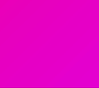

> # React masterclass

# 2 STYLED COMPONENTS

## 2.1 Our First Styled Component

```sh
npx create-react-app react-masterclass --use-npm
npm i styled-components
```

```js
const BoxOne = styled.div`
  background-color: teal;
  width: 100px;
  height: 100px;
`;
const Text = styled.span`
  color: white;
`;
..
<BoxOne>
    <Text>Hello</Text>
</BoxOne>
```

## 2.2 Adapting and Extending

- Adapting

```js
const Box = styled.div`
  background-color: ${(props) => props.bgColor};
  width: 100px;
  height: 100px;
`;
..
<Box bgColor="teal" />
```

- Extending

```js
const Circle = styled(Box)`
  border-radius: 50px;
`;
..
<Circle bgColor="tomato" />
```

## 2.3 'As' and Attrs

- convert styledComponent to other element by `as`

```js
const Btn = styled.button`
  color: white;
  background-color: tomato;
  border: 0;
  border-radius: 15px;
`;
..
<Btn as="a" href="/">  {/* convert from button to anchor */}
go home
/Btn>
```

- give default attributes

```js
const Input = styled.input.attrs({ required: true, minLength: 2 })`
  background-color: tomato;
`;
..
<Input />
<Input />
```

## 2.4 Animations and Pseudo Selectors

- Animations

```js
const rotationAnimation = keyframes`
  0% {
    transform:rotate(0deg);
    border-radius:0px;
  }
  50% {
    border-radius:100px;
  }
  100%{
    transform:rotate(360deg);
    border-radius:0px;
  }
`;
..
const Box = styled.div`
  animation: ${rotationAnimation} 1s linear infinite;
```

- Pseudo selectors
  - can use html tag inside of styled component to refer to specific child
  - & means myself

```js
const Box = styled.div`
  span {
    font-size: 36px;
    &:hover {
      font-size: 48px;
    }
    &:active {
      opacity: 0;
    }
  }
`;
..
<Wrapper>
  <Box>
    <span>🤩</span>
  </Box>
</Wrapper>
```

## 2.5 Pseudo Selectors part Two

- can use styled component name as selector => independant on html tag

```js
const Box = styled.div`
  ${Emoji}:hover {
    font-size: 98px;
  }
`;
..
<Box>
  <Emoji>🤩</Emoji>
</Box>
```

## 2.7 Themes

```js
// index.js
const darkTheme = {
  textColor: "whitesmoke",
  backgroundColor: "#111",
};
const lightTheme = {
  textColor: "#111",
  backgroundColor: "whitesmoke",
};

<ThemeProvider theme={darkTheme}>
  <App />
</ThemeProvider>;
```

```js
// App.js
const Title = styled.h1`
  color: ${(props) => props.theme.textColor};
`;
```

# 3 TYPESCRIPT

## 3.1 DefinitelyTyped

```sh
npm install --save typescript @types/node @types/react @types/react-dom @types/jest
mv src/App.js src/App.tsx
mv src/index.js src/index.tsx
npx tsc --init
```

```ts
// tsconfig.json
{
  "compilerOptions": {
    "target": "es5",
    "lib": [
      "dom",
      "dom.iterable",
      "esnext"
    ],
    "allowJs": true,
    "skipLibCheck": true,
    "esModuleInterop": true,
    "allowSyntheticDefaultImports": true,
    "strict": true,
    "forceConsistentCasingInFileNames": true,
    "noFallthroughCasesInSwitch": true,
    "module": "esnext",
    "moduleResolution": "node",
    "resolveJsonModule": true,
    "isolatedModules": true,
    "noEmit": true,
    "jsx": "react-jsx"
  },
  "include": [
    "src"
  ]
}
```

```ts
// src/index.tsx
import ReactDOM from "react-dom/client";

const root = ReactDOM.createRoot(
  document.getElementById("root") as HTMLElement
);
```

- looks like below types are included in styled-components now

```sh
npm i --save-dev @types/styled-components
```

## 3.2 Typing the Props

```ts
import styled from "styled-components";

interface CircleProps {
  bgColor: string;
}

const Container = styled.div<CircleProps>`
  width: 200px;
  height: 200px;
  background-color: ${(props) => props.bgColor};
  border-radius: 100px;
`;

function Circle({ bgColor }: CircleProps) {
  return <Container bgColor={bgColor} />;
}

export default Circle;
```

## 3.3 Optional Props

```ts
interface CircleProps {
  bgColor: string;
  borderColor?: string;
  text?: string;
}

function Circle({ bgColor, borderColor, text = "default text" }: CircleProps) {
```

## 3.4 State

```ts
const [value, setValue] = useState<string | number>("");
setValue(1);
```

## 3.5 Forms

```ts
const [value, setValue] = useState("");
const onChange = (event: React.ChangeEvent<HTMLInputElement>) => {
  const {
    currentTarget: { value },
  } = event;
  setValue(value);
};
const onSubmit = (event: React.FormEvent<HTMLFormElement>) => {
  event.preventDefault();
  console.log("value:", value);
};
    ..
    <form onSubmit={onSubmit}>
      <input
        value={value}
        onChange={onChange}
        type="text"
        placeholder="username"
      />
      <button>Log in</button>
    </form>
    ..
```

## 3.6 Themes

- extend module

```ts
// touch src/styled.d.ts
import "styled-components";
declare module "styled-components" {
  export interface DefaultTheme {
    textColor: string;
    bgColor: string;
    btnColor: string;
  }
}
```

- configure theme

```ts
// touch src/theme.ts
import { DefaultTheme } from "styled-components";
export const lightTheme: DefaultTheme = {
  bgColor: "white",
  textColor: "black",
  btnColor: "tomato",
};
export const darkTheme: DefaultTheme = {
  bgColor: "black",
  textColor: "white",
  btnColor: "teal",
};
```

- provide theme

```ts
// src/index.tsx
<ThemeProvider theme={darkTheme}>
  <App />
</ThemeProvider>
```

- use theme

```ts
const Container = styled.div`
  background-color: ${(props) => props.theme.bgColor};
`;
const H1 = styled.h1`
  color: ${(props) => props.theme.textColor};
`;
    ..
    <Container>
      <H1>protected</H1>
    </Container>
    ..
```

# 5 CRYPTO TRACKER

## 5.0 Setup

```
npm i react-router-dom@5.3.4
npm i --save-dev @types/react-router
npm i --save-dev @types/react-router-dom

mkdir -p src/routes
touch src/routes/Coin.tsx
touch src/routes/Coins.tsx
touch src/Router.tsx
```

```ts
function Router() {
  return (
    <BrowserRouter>
      <Switch>
        <Route path="/:coinId">
          <Coin />
        </Route>
        <Route path="/">
          <Coins />
        </Route>
      </Switch>
    </BrowserRouter>
  );
}
```

## 5.1 Styles

- reset style with pasting [this](https://github.com/zacanger/styled-reset/blob/master/src/index.ts) to createGlobalStyle

  - or use package: [styled-reset](https://www.npmjs.com/package/styled-reset)

```ts
// src/App.tsx
const GlobalStyle = createGlobalStyle`
@import url('https://fonts.googleapis.com/css2?family=Source+Sans+Pro:wght@300;400&display=swap');
html, body, div, span, applet, object, iframe,
h1, h2, h3, h4, h5, h6, p, blockquote, pre,
a, abbr, acronym, address, big, cite, code,
del, dfn, em, img, ins, kbd, q, s, samp,
small, strike, strong, sub, sup, tt, var,
b, u, i, center,
dl, dt, dd, menu, ol, ul, li,
fieldset, form, label, legend,
table, caption, tbody, tfoot, thead, tr, th, td,
article, aside, canvas, details, embed,
figure, figcaption, footer, header, hgroup,
main, menu, nav, output, ruby, section, summary,
time, mark, audio, video {
  margin: 0;
  padding: 0;
  border: 0;
  font-size: 100%;
  font: inherit;
  vertical-align: baseline;
}
/* HTML5 display-role reset for older browsers */
article, aside, details, figcaption, figure,
footer, header, hgroup, main, menu, nav, section {
  display: block;
}
/* HTML5 hidden-attribute fix for newer browsers */
*[hidden] {
    display: none;
}
body {
  line-height: 1;
}
menu, ol, ul {
  list-style: none;
}
blockquote, q {
  quotes: none;
}
blockquote:before, blockquote:after,
q:before, q:after {
  content: '';
  content: none;
}
table {
  border-collapse: collapse;
  border-spacing: 0;
}
* {
  box-sizing: border-box;
}
body {
  font-family: 'Source Sans Pro', sans-serif;
  background-color:${(props) => props.theme.bgColor};
  color:${(props) => props.theme.textColor}
}
a {
  text-decoration:none;
}
`;

function App() {
  return (
    <>
      <GlobalStyle />
      <Router />
    </>
  );
}
```

- font setup

```css
@import url('https://fonts.googleapis.com/css2?family=Source+Sans+Pro:wght@300;400&display=swap');
..
body {
  font-family: 'Source Sans Pro', sans-serif;
```

- color palette: https://flatuicolors.com/palette/gb

## 5.2 Home part One

- Link to

```ts
<Link to={`/${coin.id}`}>{coin.name} &rarr;</Link>
```

## 5.3 Home part Two

- fetch API

```ts
useEffect(() => {
  (async () => {
    const response = await fetch("https://api.coinpaprika.com/v1/coins");
    const json = await response.json();
    setCoins(json.slice(0, 100));
    setLoading(false);
  })();
}, []);
```

## 5.4 Route States

- send state by Link
  - if access directly without send state => Loading

```ts
// Coins.tsx
<Link
  to={{
    pathname: `/${coin.id}`,
    state: { name: coin.name },
  }}
>
```

```ts
// Coin.tsx
interface RouteParams {
  coinId: string;
}
interface RouteState {
  name: string;
}
..
  const { coinId } = useParams<RouteParams>();
  const { state } = useLocation<RouteState>();
```

## 5.5 Coin Data

```ts
useEffect(() => {
  (async () => {
    const infoData = await (
      await fetch(`https://api.coinpaprika.com/v1/coins/${coinId}`)
    ).json();
    const priceData = await (
      await fetch(`https://api.coinpaprika.com/v1/tickers/${coinId}`)
    ).json();
    setInfo(infoData);
    setPriceInfo(priceData);
  })();
}, []);
```

## 5.6 Data Types

- type inference workaround: dev console => Store object as global variable

```js
console.log(
  Object.entries(temp1)
    .map((a) => `${a[0]}: ${typeof a[1]};`)
    .join("\r\n")
);
```

## 5.7 Nested Routes part One

```
touch src/routes/Price.tsx
touch src/routes/Chart.tsx
```

- nested routes render components which fit with route

```ts
// Coin.tsx
<Switch>
  <Route path={`/${coinId}/price`}>
    <Price />
  </Route>
  <Route path={`/${coinId}/chart`}>
    <Chart />
  </Route>
</Switch>
```

## 5.8 Nested Routes part Two

- check if it's that route with useRouteMatch

```ts
const priceMatch = useRouteMatch("/:coinId/price");
const chartMatch = useRouteMatch("/:coinId/chart");
..
<Tabs>
  <Tab isActive={chartMatch !== null}>
    <Link to={`/${coinId}/chart`}>Chart</Link>
  </Tab>
  <Tab isActive={priceMatch !== null}>
    <Link to={`/${coinId}/price`}>Price</Link>
  </Tab>
</Tabs>;
```

- /:coinId parse the first keyword

```ts
<Route path={`/:coinId/price`}>
```

## 5.9 React Query part One

```sh
npm i react-query
```

- wrap with QueryClientProvider

```ts
// src/index.tsx
const queryClient = new QueryClient();
..
  <QueryClientProvider client={queryClient}>
    <ThemeProvider theme={theme}>
      <App />
    </ThemeProvider>
  </QueryClientProvider>
```

- define fetcher

```ts
// touch src/api.ts
export function fetchCoins() {
  return fetch("https://api.coinpaprika.com/v1/coins").then((response) =>
    response.json()
  );
}
```

- fetch data

```ts
const { isLoading, data } = useQuery<ICoin[]>("allCoins", fetchCoins);
```

## 5.10 React Query part Two

- ReactQueryDevtools shows cached data

```ts
// src/App.tsx
..
<Router />
<ReactQueryDevtools initialIsOpen={false} />
```

## 5.12 Price Chart

- solve unknown prop "isActive" warning

```ts
// src/App.tsx
<>
  <StyleSheetManager shouldForwardProp={(prop) => prop !== "isActive"}>
    ..
  </StyleSheetManager>
</>
```

## 5.13 Price Chart part Two

```sh
npm install --save react-apexcharts apexcharts
```

```ts
// src/routes/Chart.tsx
<ApexChart
  type="line"
  series={[
    {
      name: "Price",
      data: data?.map((price) => price.close),
    },
  ]}
  options={{
    theme: {
      mode: "dark",
    },
    chart: {
      height: 300,
      width: 500,
      toolbar: {
        show: false,
      },
      background: "transparent",
    },
    grid: { show: false },
    stroke: {
      curve: "smooth",
      width: 4,
    },
    yaxis: {
      show: false,
    },
    xaxis: {
      axisBorder: { show: false },
      axisTicks: { show: false },
      labels: { show: false },
    },
  }}
/>
```

## 5.14 Price Chart part Three

```ts
fill: {
  type: "gradient",
  gradient: { gradientToColors: ["#0be881"], stops: [0, 100] },
},
..
tooltip: {
  y: {
    formatter: (value) => `$${value.toFixed(2)}`,
  },
},
```

## 5.15 Final Touches

```sh
npm i react-helmet @types/react-helmet
```

- refetchInterval

```ts
const { isLoading: tickersLoading, data: tickersData } = useQuery<PriceData>(
  ["tickers", coinId],
  () => fetchCoinTickers(coinId),
  {
    refetchInterval: 5000,
  }
);
```

## 5.16 Conclusions

### Challenge

1. make go back button
2. render prices
3. replace barChart to candlestickChart

# 6 STATE MANAGEMENT

## 6.0 Dark Mode part One

- should move Provider from `index.tsx` to `App.tsx` to use theme with state

```ts
// src/App.tsx
<ThemeProvider theme={isDark ? darkTheme : lightTheme}>
  <button onClick={toggleDark}>Toggle Mode</button>
  ..
</ThemeProvider>
```

## 6.1 Dark Mode part Two

- nested props make redundant inheritances
- only few children needs state or modification

```
App (isDark, setIsDark)
=> Router => Coins(setIsDark)
=> Router => Coin => Chart(isDark)
```

## 6.2 Introduction to Recoil

```sh
npm install recoil
```

```ts
// touch src/atoms.ts
import { atom } from "recoil";

export const isDarkAtom = atom({
  key: "isDark",
  default: true,
});
```

```ts
// src/index.tsx
<RecoilRoot>
  <QueryClientProvider client={queryClient}>
    <App />
  </QueryClientProvider>
</RecoilRoot>
```

```ts
// src/App.tsx
const isDark = useRecoilValue(isDarkAtom);
```

- Any component can acces to the state

```sh
App -> (isDark) <- App.Router.Coin.Chart
```

## 6.3 Introduction to Recoil part Two

```ts
const setDarkAtom = useSetRecoilState(isDarkAtom);
const toggleDarkAtom = () => setDarkAtom((prev) => !prev);
..
<button onClick={toggleDarkAtom}>Toggle Mode</button>
```

## 6.5 To Do Setup

- rearrange apps

## 6.6 Forms

```sh
npm i react-hook-form
```

```ts
// src/ToDoList.tsx
const { register, watch } = useForm();
console.log(watch());
..
    <form>
      <input {...register("email")} placeholder="Email" />
      ..
```

## 6.7 Form Validation

- handleSubmit
- form validation: required, minLength, custom message.. by `formState.errors`

```ts
// src/ToDoList.tsx
<input
  {...register("password1", {
    required: "Password is required",
    minLength: {
      value: 5,
      message: "Your password is too short.",
    },
  })}
  placeholder="Password1"
/>
```

## 4.8 Form Errors

```ts
// src/ToDoList.tsx
<span>{errors?.password1?.message}</span>
```

## 6.9 Custom Validation

### Custom error

- set message and shouldFocus on error
  - for existing field
  - for extra field like `server offline`

```ts
const onValid = (data: IForm) => {
  if (data.password !== data.password1) {
    setError(
      "password1",
      { message: "Password are not the same" },
      { shouldFocus: true }
    );
  }
  setError("extraError", { message: "Server offline." });
};
```

### Custom validator

#### Return type

- invalid: return false or error message
- valid: return true

#### How to use

1. type field becomes `validate` by default

```ts
validate: (value) => bool | string;
```

2. set specific type

```ts
validate: {
  validateType: (value) => bool | string;
}
```

```tsx
// src/ToDoList.tsx
<input
  {...register("firstName", {
    required: "write here",
    // validate: (value) => "error",
    validate: {
      noNico: (value) => (value.includes("nico") ? "no nicos allowed" : true),
      noNick: (value) => (value.includes("nick") ? "no nick allowed" : true),
    },
  })}
  placeholder="First Name"
/>
```

## 6.10 Recap

- clear practices and start to write todo

## 6.11 Add To Do

```
mkdir src/components
mv src/routes/Coin src/components
mv src/routes/Todo src/components
```

- useRecoilState = useRecoilValue + useSetRecoilState

```ts
// const toDos = useRecoilValue(toDoState);
// const setToDos = useSetRecoilState(toDoState);
const [toDos, setToDos] = useRecoilState(toDoState);
```

## 6.12 Refactoring

- fix urls of coin: `/:coinId/chart => /coin/:coinId/chart`
- split each apps into `/apps`
- split from `ToDoList` to `CreateTodo` and `Todo`

## 6.13 Categories

- add callback to get target onClick

## 6.14 Immutability part One

- find targetIndex by `findIndex`

```ts
// Todo.tsx
const targetIndex = oldToDos.findIndex((toDo) => toDo.id === id);
```

## 6.15 Immutability part Two

- create new array with `slice`

```ts
// Todo.tsx
const newToDo = { text, id, category: name as any };
return [
  ...oldToDos.slice(0, targetIndex),
  newToDo,
  ...oldToDos.slice(targetIndex + 1),
];
```

## 6.16 Selectors part One

- selector like Computed field

```ts
// src/apps/Todo/atoms.tsx
export const toDoSelector = selector({
  key: "toDoSelector",
  get: ({ get }) => {
    const toDos = get(toDoState);
    return [
      toDos.filter((toDo) => toDo.category === "TO_DO"),
      toDos.filter((toDo) => toDo.category === "DOING"),
      toDos.filter((toDo) => toDo.category === "DONE"),
    ];
  },
});

// src/apps/Todo/components/ToDoList.tsx
const [toDo, doing, done] = useRecoilValue(toDoSelector);
..
```

## 6.17 Selectors part Two

- can filter by another state

```ts
export const categoryState = atom({
  key: "category",
  default: "TO_DO",
});

export const toDoSelector = selector({
  key: "toDoSelector",
  get: ({ get }) => {
    const toDos = get(toDoState);
    const category = get(categoryState);
    return toDos.filter((toDo) => toDo.category === category);
  },
```

## 6.18 Enums

- wrap category with enum

```ts
export enum Categories {
  "TO_DO" = "TO_DO",
  "DOING" = "DOING",
  "DONE" = "DONE",
}

export const categoryState = atom<Categories>({
  key: "category",
  default: Categories.TO_DO,
});
```

# 7 TRELLO CLONE

## 7.0 Get Selectors

- computed field for hour from minutes

```ts
export const hourSelector = selector({
  key: "hours",
  get: ({ get }) => {
    const minutes = get(minuteState);
    return minutes / 60;
  },
});
```

## 7.1 Set Selectors

- setState with selector

```ts
export const hourSelector = selector<number>({
  ..
  set: ({ set }, newValue) => {
    const minutes = Number(newValue) * 60;
    set(minuteState, minutes);
  },
});
```

## 7.3 Drag and Drop part Two

```sh
npm i react-beautiful-dnd@^13.1.0 @types/react-beautiful-dnd@13.1.2
mv src/apps/Trello/Trello.tsx src/apps/Trello/StudySelector.tsx
touch src/apps/Trello/StudyDrag.tsx
```

- should remove StrictMode at `src/index.tsx`

```ts
export default function StudyDrag() {
  const onDragEnd = () => {};
  return (
    <DragDropContext onDragEnd={onDragEnd}>
      <div>
        <Droppable droppableId="one">
          {(magic) => (
            <ul ref={magic.innerRef} {...magic.droppableProps}>
              <Draggable draggableId="first" index={0}>
                {(magic) => (
                  <li ref={magic.innerRef} {...magic.draggableProps}>
                    <span {...magic.dragHandleProps}>🔥</span>
                    One
                  </li>
                )}
              </Draggable>
              <Draggable draggableId="second" index={1}>
                {(magic) => (
                  <li ref={magic.innerRef} {...magic.draggableProps}>
                    <span {...magic.dragHandleProps}>🔥</span>
                    Two
                  </li>
                )}
              </Draggable>
            </ul>
          )}
        </Droppable>
      </div>
    </DragDropContext>
  );
}
```

## 7.4 Styles and Placeholders

- chore: impl styled components, and change dark theme
- placeholder can keep the place even after dragging

```ts
<Droppable droppableId="one">
  {(magic) => (
    <Board ref={magic.innerRef} {...magic.droppableProps}>
      {toDos.map((toDo, index) => (
        <Draggable draggableId={toDo} index={index}>
          {(magic) => (
            <Card
              ref={magic.innerRef}
              {...magic.dragHandleProps}
              {...magic.draggableProps}
            >
              {toDo}
            </Card>
          )}
        </Draggable>
      ))}
      {magic.placeholder}
    </Board>
  )}
</Droppable>
```

## 7.6 Reordering part Two

- onDragEnd gived source and destination
- Draggable `key` should be identical with `draggableId`

```ts
const onDragEnd = ({ draggableId, destination, source }: DropResult) => {
  if (!destination) return;
  setToDos((oldToDos) => {
    const toDosCopy = [...oldToDos];
    // 1) Delete item on source.index
    console.log("Delete item on", source.index);
    console.log(toDosCopy);
    toDosCopy.splice(source.index, 1);
    console.log("Deleted item");
    console.log(toDosCopy);
    // 2) Put back the item on the destination.index
    console.log("Put back", draggableId, "on ", destination.index);
    toDosCopy.splice(destination?.index, 0, draggableId);
    console.log(toDosCopy);
    return toDosCopy;
  });
};
..
<DragDropContext onDragEnd={onDragEnd}>
  <Draggable key={toDo} draggableId={toDo} index={index}>
```

## 7.7 Performance

- extract `Components/DragabbleCard.tsx`
- Optimize with `React.memo` => rerender only mutated

```ts
export default React.memo(DragabbleCard);
```

## 7.8 Multi Boards

- extract `Components/Board.tsx`

## 7.9 Same Board Movement

- handle case when droppableID is identical

```ts
const onDragEnd = (info: DropResult) => {
  console.log(info);
  const { destination, draggableId, source } = info;
  if (destination?.droppableId === source.droppableId) {
    // same board movement.
    setToDos((allBoards) => {
      const boardCopy = [...allBoards[source.droppableId]];
      boardCopy.splice(source.index, 1);
      boardCopy.splice(destination?.index, 0, draggableId);

      return {
        ...allBoards,
        [source.droppableId]: boardCopy,
      };
    });
  }
};
```

## 7.10 Cross Board Movement

- handle case when destination.droppableId !== source.droppableId

```ts
if (destination.droppableId !== source.droppableId) {
  // cross board movement
  setToDos((allBoards) => {
    const sourceBoard = [...allBoards[source.droppableId]];
    const destinationBoard = [...allBoards[destination.droppableId]];
    sourceBoard.splice(source.index, 1);
    destinationBoard.splice(destination?.index, 0, draggableId);
    return {
      ...allBoards,
      [source.droppableId]: sourceBoard,
      [destination.droppableId]: destinationBoard,
    };
  });
}
```

## 7.11 Droppable Snapshot

- colorize with isDragginOver & draggingFromThisWith
- `flex-grow: 1` takes height as much as possible => broad Droppable area

```ts
const Area = styled.div<IAreaProps>`
  background-color: ${(props) =>
    props.isDraggingOver ? "pink" : props.isDraggingFromThis ? "red" : "blue"};
  flex-grow: 1;
  transition: background-color 0.3s ease-in-out;
`;
..
<Droppable droppableId={boardId}>
  {(magic, info) => (
    <Area
      isDraggingOver={info.isDraggingOver}
      isDraggingFromThis={Boolean(info.draggingFromThisWith)}
      ref={magic.innerRef}
      {...magic.droppableProps}
    >
```

## 7.12 Final Styles

```ts
// src/apps/Trello/Components/DragabbleCard.tsx
const Card = styled.div<{ isDragging: boolean }>`
  border-radius: 5px;
  margin-bottom: 5px;
  padding: 10px;
  background-color: ${(props) =>
    props.isDragging ? "#e4f2ff" : props.theme.cardColor};
  box-shadow: ${(props) =>
    props.isDragging ? "0px 2px 5px rgba(0, 0, 0, 0.05)" : "none"};
`;
```

```ts
// src/apps/Trello/Components/Board.tsx
const Area = styled.div<IAreaProps>`
  background-color: ${(props) =>
    props.isDraggingOver
      ? "#dfe6e9"
      : props.isDraggingFromThis
      ? "#b2bec3"
      : "transparent"};
  flex-grow: 1;
  transition: background-color 0.3s ease-in-out;
  padding: 20px;
`;
```

## 7.13 Refs

- ref serves to use event on html tags like `focus`, `blur`

```ts
const inputRef = useRef<HTMLInputElement>(null);
const onClick = () => {
  inputRef.current?.focus();
  setTimeout(() => {
    inputRef.current?.blur();
  }, 5000);
};
..
<input ref={inputRef} placeholder="grab me" />
```

## 7.14 Task Objects

- string[] to ITodo[]

```ts
// src/atoms.tsx
export interface ITodo {
  id: number;
  text: string;
}

interface IToDoState {
  [key: string]: ITodo[];
}
```

- substitute useRef with `useForm`

## 7.15 Creating Tasks

- splice with ITodo

```ts
const taskObj = boardCopy[source.index];
boardCopy.splice(source.index, 1);
boardCopy.splice(destination?.index, 0, taskObj);
```

- handleSubmit

```ts
const onValid = ({ toDo }: IForm) => {
  const newToDo = {
    id: Date.now(),
    text: toDo,
  };
  setToDos((allBoards) => {
    return {
      ...allBoards,
      [boardId]: [newToDo, ...allBoards[boardId]],
    };
  });
  setValue("toDo", "");
};
```

## 7.16 Code Challenge

- `mv src/apps/Trello/StudyDrag.tsx src/apps/Trello/Trello.tsx`
- chore: update styled.form

1. delete todo with drag
2. persistant save
3. create board
4. DnD boards

# 8 ANIMATIONS

## 8.0 Introduction

- style setup

```diff
# src/App.tsx
body {
  ..
- background-color:${(props) => props.theme.bgColor};
+ background:linear-gradient(135deg,#e09,#d0e);
```

## 8.1 Installation

```sh
npm i framer-motion
```

- To animate, it should be `motion.{htmlTag}`

```ts
import { motion } from "framer-motion";
..
<motion.div></motion.div>
```

## 8.2 Basic Animations

- with styled component
- transition.type like curve
- initial to animate



```ts
// src/apps/Animation/animations/Spinner.tsx
const Box = styled(motion.div)`
  width: 200px;
  height: 200px;
  background-color: white;
  border-radius: 15px;
  box-shadow: 0 2px 3px rgba(0, 0, 0, 0.1), 0 10px 20px rgba(0, 0, 0, 0.06);
`;

export function Spinner() {
  return (
    <Wrapper>
      <Box
        transition={{ type: "spring", delay: 0.5 }}
        initial={{ scale: 0 }}
        animate={{ scale: 1, rotateZ: 360 }}
      />
    </Wrapper>
  );
}
```

## 8.3 Variants part One

- initial == start
- animate == end

```ts
const myVars = {
  start: { scale: 0 },
  end: { scale: 1, rotateZ: 360, transition: { type: "spring", delay: 0.5 } },
};
..
<Box variants={myVars} initial="start" animate="end" />;
```

## 8.4 Variants part Two


- split animations with routes
- delayChildren: start all children with delay
- staggerChildren: give interval to each children to work consequently

```ts
// src/apps/Animation/animations/IphoneCamera.tsx
const boxVariants = {
  start: {
    opacity: 0,
    scale: 0.5,
  },
  end: {
    scale: 1,
    opacity: 1,
    transition: {
      type: "spring",
      duration: 0.5,
      bounce: 0.5,
      delayChildren: 0.5,
      staggerChildren: 0.2,
    },
  },
};
```

## 8.5 Gestures part One


```ts
// src/apps/Animation/animations/Gesture.tsx
const boxVariants = {
  hover: { scale: 1.5, rotateZ: 90 },
  click: { scale: 1, borderRadius: "100px" },
  drag: { backgroundColor: "rgb(46, 204, 113)", transition: { duration: 10 } },
};
..
<Box
  drag
  variants={boxVariants}
  whileHover="hover"
  whileDrag="drag"
  whileTap="click"
/>
```

## 8.6 Gestures part Two


- give dragConstraints with ref
- dragElastic allows over than constraints

```ts
const biggerBoxRef = useRef<HTMLDivElement>(null);
return (
  <Wrapper>
    <BiggerBox ref={biggerBoxRef}>
      <Box
        drag
        dragSnapToOrigin
        dragElastic={0.1}
        dragConstraints={biggerBoxRef}
        variants={boxVariants}
        whileHover="hover"
        whileTap="click"
      />
    </BiggerBox>
    ..
```

## 8.7 MotionValues part One


- motion value does not trigger react render cycle: it's not react state

```ts
// src/apps/Animation/animations/MotionValue.tsx
const x = useMotionValue(0);
useEffect(() => {
  x.onChange((latest) => {
    console.log(latest);
  });
}, [x]);
return (
  <Wrapper>
    <Box style={{ x }} drag="x" dragSnapToOrigin />
  </Wrapper>
);
```

## 8.8 MotionValues part Two


- useTransform animates scale

```ts
// src/apps/Animation/animations/MotionValue.tsx
const scale = useTransform(x, [-800, 0, 800], [2, 1, 0.1]);
..
<Box style={{ x, scale }} drag="x" dragSnapToOrigin />
```

## 8.9 MotionValues part Three


- rotateZ roll the component while scrolling x
- useViewportScroll().scroll: gives absolute value, scrollYprogress gives interpolated value from 0 to 1

```ts
// src/apps/Animation/animations/MotionValue.tsx
const x = useMotionValue(0);
const rotateZ = useTransform(x, [-800, 800], [-360, 360]);
const gradient = useTransform(
  x,
  [-800, 800],
  [
    "linear-gradient(135deg, rgb(0, 210, 238), rgb(0, 83, 238))",
    "linear-gradient(135deg, rgb(0, 238, 155), rgb(238, 178, 0))",
  ]
);
const { scrollYProgress } = useViewportScroll();
const scale = useTransform(scrollYProgress, [0, 1], [1, 5]);
..
  <Wrapper style={{ background: gradient }}>
    <Box style={{ x, rotateZ, scale }} drag="x" dragSnapToOrigin />
  </Wrapper>
```

## 8.10 SVG Animation


- pathLength draws svg from 0 to 1

```ts
// src/apps/Animation/animations/SVG.tsx
const svg = {
  start: { pathLength: 0, fill: "rgba(255, 255, 255, 0)" },
  end: {
    fill: "rgba(255, 255, 255, 1)",
    pathLength: 1,
  },
};
..
<Svg
  focusable="false"
  xmlns="http://www.w3.org/2000/svg"
  viewBox="0 0 448 512"
>
  <motion.path
    variants={svg}
    initial="start"
    animate="end"
    transition={{
      default: { duration: 5 },
      fill: { duration: 1, delay: 3 },
    }}
    ..
```

## 8.11 AnimatePresence


- AnimatePresence allows components to animate out when they're removed from the React tree.

```ts
const boxVariants = {
  initial: {
    opacity: 0,
    scale: 0,
  },
  visible: {
    opacity: 1,
    scale: 1,
    rotateZ: 360,
  },
  leaving: {
    opacity: 0,
    scale: 0,
    y: 50,
  },
};
..
<AnimatePresence>
  {showing ? (
    <Box
      variants={boxVariants}
      initial="initial"
      animate="visible"
      exit="leaving"
    />
  ) : null}
</AnimatePresence>
```

## 8.13 Slider part Two


- slideX from +500 to -500
- custom sends data to variant which allows to use callback
  - should set on both AnimatePresence and child component
- `AnimatePresence.mode="wait"` waits till prev component completely exits

```ts
const box = {
  entry: (back: boolean) => ({
    x: 500 * (back ? -1 : 1),
    opacity: 0,
    scale: 0,
  }),
  center: {
    x: 0,
    opacity: 1,
    scale: 1,
    transition: {
      duration: 0.3,
    },
  },
  exit: (back: boolean) => ({
    x: 500 * (back ? 1 : -1),
    opacity: 0,
    scale: 0,
    transition: { duration: 0.3 },
  }),
};
..
const [visible, setVisible] = useState(1);
const [back, setBack] = useState(false);
const nextPlease = () =>
  setVisible((prev) => {
    setBack(false);
    return prev === 10 ? 10 : prev + 1;
  });
const prevPlease = () =>
  setVisible((prev) => {
    setBack(true);
    return prev === 1 ? 1 : prev - 1;
  });
..
<AnimatePresence custom={back} mode="wait">
  <Box
    custom={back}
    variants={box}
    initial="entry"
    animate="center"
    exit="exit"
    key={visible}
  >
    {visible}
  </Box>
</AnimatePresence>
```

## 8.14 You Need to Watch This

### layout


- animate from a component to another by just assigning `layoutId`

```ts
<Circle layoutId="circle" style={{ borderRadius: 50 }} />
<Circle layoutId="circle" style={{ borderRadius: 0, scale: 2 }} />
```

## 8.16 Final Project part Two


- connect with layoutId from grid child to centered Box on Overlay

```ts
<Grid>
  {["1", "2", "3", "4"].map((n) => (
    <Box onClick={() => setId(n)} key={n} layoutId={n} />
  ))}
</Grid>
<AnimatePresence>
  {id ? (
    <Overlay
      variants={overlay}
      onClick={() => setId(null)}
      initial="hidden"
      animate="visible"
      exit="exit"
    >
      <Box layoutId={id} style={{ width: 400, height: 200 }} />
    </Overlay>
  ) : null}
</AnimatePresence>
```

# 9 NOMFLIX CLONE

## 9.0 Introduction

- create Nomflix app

## 9.1 Header part One

- create Home, Search, Tv
- create Header with netflix svg logo

## 9.2 Header part Two

- with `transition.repeat: infinity`

```ts
// src/apps/Nomflix/Components/Header.tsx
const logoVariants = {
  normal: {
    fillOpacity: 1,
  },
  active: {
    fillOpacity: [0, 1, 0],
    transition: {
      repeat: Infinity,
    },
  },
};
```

## 9.3 Header part Three

- animate selected tab with layoutId

```ts
<Link to="/"> Home {homeMatch?.isExact && <Circle layoutId="circle" />} </Link>
<Link to="/tv"> Tv Shows {tvMatch && <Circle layoutId="circle" />} </Link>
```

- animate SearchBar to -180 on click

```ts
<Search>
  <motion.svg
    onClick={toggleSearch}
    animate={{ x: searchOpen ? -180 : 0 }}
    transition={{ type: "linear" }}
    fill="currentColor"
  >
    ..
  </motion.svg>
  <Input
    transition={{ type: "linear" }}
    animate={{ scaleX: searchOpen ? 1 : 0 }}
    placeholder="Search for movie or tv show..."
  />
</Search>
```

## 9.4 Header part Four

- show NavBar when scrollY is over than 80

```ts
const navVariants = {
  top: {
    backgroundColor: "rgba(0, 0, 0, 0)",
  },
  scroll: {
    backgroundColor: "rgba(0, 0, 0, 1)",
  },
};
const inputAnimation = useAnimation();
const navAnimation = useAnimation();
useEffect(() => {
  scrollY.onChange(() => {
    if (scrollY.get() > 80) {
      navAnimation.start("scroll");
    } else {
      navAnimation.start("top");
    }
  });
}, [scrollY, navAnimation]);
..
<Nav variants={navVariants} animate={navAnimation} initial={"top"}>
```

## 9.5 Home Screen part One

```ts
const BASE_PATH = "https://api.themoviedb.org/3";

export function getMovies() {
  return fetch(`${BASE_PATH}/movie/now_playing?api_key=${API_KEY}`).then(
    (response) => response.json()
  );
}
```

## 9.6 Home Screen part Two

- linear gradient

```ts
const Banner = styled.div<{ bgPhoto: string }>`
  background-image: linear-gradient(rgba(0, 0, 0, 0), rgba(0, 0, 0, 1)), url(${(
      props
    ) => props.bgPhoto});
  background-size: cover;
`;
```

## 9.7 Slider part One

- slider from +10 to -10 on click

```ts
const rowVariants = {
  hidden: {
    x: window.outerWidth + 10,
  },
  visible: {
    x: 0,
  },
  exit: {
    x: -window.outerWidth - 10,
  },
};
..
<Slider>
  <AnimatePresence>
    <Row
      variants={rowVariants}
      initial="hidden"
      animate="visible"
      exit="exit"
      transition={{ type: "tween", duration: 1 }}
      key={index}
    >
      {[1, 2, 3, 4, 5, 6].map((i) => (
        <Box key={i}>{i}</Box>
      ))}
    </Row>
  </AnimatePresence>
</Slider>
```

## 9.8 Slider part Two

- onExitComplete: only when completed, we can increase index again => fix empty hole bug

```ts
  const [leaving, setLeaving] = useState(false);
  const incraseIndex = () => {
    if (data) {
      if (leaving) return;
      toggleLeaving();
      const totalMovies = data.results.length - 1;
      const maxIndex = Math.floor(totalMovies / offset) - 1;
      setIndex((prev) => (prev === maxIndex ? 0 : prev + 1));
    }
  };
  const toggleLeaving = () => setLeaving((prev) => !prev);
  return (
    ..
          <Banner
            onClick={incraseIndex}
            ..
          </Banner>
          <Slider>
            <AnimatePresence initial={false} onExitComplete={toggleLeaving}>
```

## 9.9 Box Animations part One

- handle most left and most right to center

```css
/* src/apps/Nomflix/Routes/Home.tsx */
&:first-child {
  transform-origin: center left;
}
&:last-child {
  transform-origin: center right;
}
```

- scale up on hover

```ts
// src/apps/Nomflix/Routes/Home.tsx
const boxVariants = {
  normal: {
    scale: 1,
  },
  hover: {
    scale: 1.3,
    y: -50,
    transition: {
      delay: 0.5,
      duaration: 0.3,
      type: "tween",
    },
  },
};
```

## 9.10 Box Animations part Two

- animate opcaity from 0 to 1 on hover

```ts
// src/apps/Nomflix/Routes/Home.tsx
const Info = styled(motion.div)`
  padding: 10px;
  background-color: ${(props) => props.theme.black.lighter};
  opacity: 0;
  position: absolute;
  width: 100%;
  bottom: 0;
  h4 {
    text-align: center;
    font-size: 18px;
  }
`;

const infoVariants = {
  hover: {
    opacity: 1,
    transition: {
      delay: 0.5,
      duaration: 0.1,
      type: "tween",
    },
  },
};
```

## 9.11 Movie Modal

- open modal with layoutId

```ts
// src/apps/Nomflix/Routes/Home.tsx
const bigMovieMatch = useRouteMatch<{ movieId: string }>("/movies/:movieId");
..
 <Box
  layoutId={movie.id + ""}
..
bigMovieMatch ? (
  <motion.div
    layoutId={bigMovieMatch.params.movieId}
    style={{
      position: "absolute",
      width: "40vw",
      height: "80vh",
      backgroundColor: "red",
      top: 50,
      left: 0,
      right: 0,
      margin: "0 auto",
    }}
  />
) : null;
```

## 9.12 Movie Modal part Two

- modal should appear wherever scroll is

```ts
const { scrollY } = useViewportScroll();
..
<BigMovie
  style={{ top: scrollY.get() + 100 }}
  layoutId={bigMovieMatch.params.movieId}
>
  hello
</BigMovie>
```

## 9.13 Movie Modal part Three

- find clickedMovie

```ts
const clickedMovie =
  bigMovieMatch?.params.movieId &&
  data?.results.find((movie) => movie.id === +bigMovieMatch.params.movieId);
..
<BigMovie
  style={{ top: scrollY.get() + 100 }}
  layoutId={bigMovieMatch.params.movieId}
>
  {clickedMovie && (
    <>
      <BigCover
        style={{
          backgroundImage: `linear-gradient(to top, black, transparent), url(${makeImagePath(
            clickedMovie.backdrop_path,
            "w500"
          )})`,
        }}
      />
      <BigTitle>{clickedMovie.title}</BigTitle>
      <BigOverview>{clickedMovie.overview}</BigOverview>
    </>
  )}
</BigMovie>
```

## 9.14 Search Redirect

- js `URLSearchParams` to parse query

```ts
// src/apps/Nomflix/Routes/Search.tsx
const location = useLocation();
const keyword = new URLSearchParams(location.search).get("keyword");
```

- fix router from `/` to `/nomflix`

## 9.15 Conclusions + Challenge

- more movies on Home
- impl TV show page
- impl search results by search API URL
- improve movie detail with rich infomation
